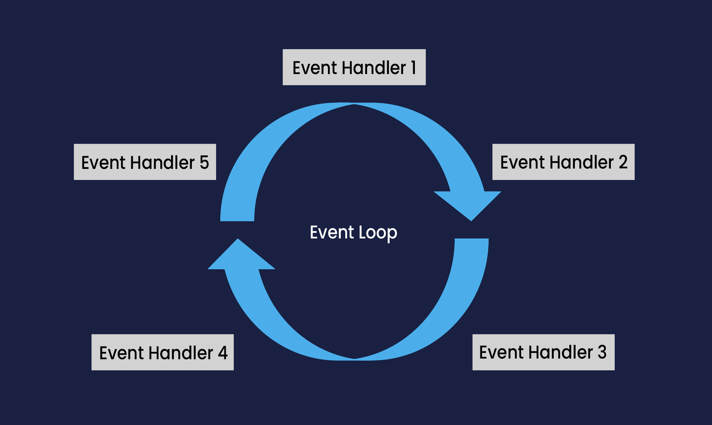
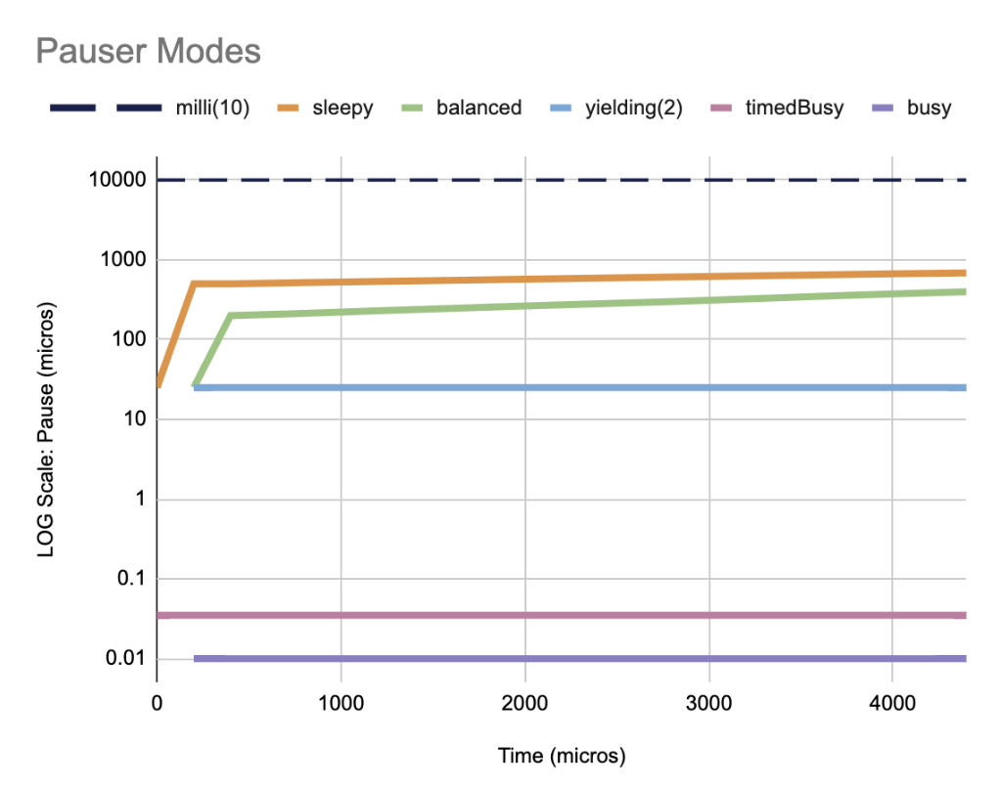

= Chronicle Threads
Chronicle Software
:css-signature: demo
:toc: macro
:toclevels: 2
:icons: font

image:https://maven-badges.herokuapp.com/maven-central/net.openhft/chronicle-threads/badge.svg[caption="",link=https://maven-badges.herokuapp.com/maven-central/net.openhft/chronicle-threads]
image:https://javadoc.io/badge2/net.openhft/chronicle-threads/javadoc.svg[link="https://www.javadoc.io/doc/net.openhft/chronicle-threads/latest/index.html"]
image:https://img.shields.io/github/license/OpenHFT/Chronicle-Threads[GitHub]
image:https://img.shields.io/badge/release%20notes-subscribe-brightgreen[link="https://chronicle.software/release-notes/"]
image:https://sonarcloud.io/api/project_badges/measure?project=OpenHFT_Chronicle-Threads&metric=alert_status[link="https://sonarcloud.io/dashboard?id=OpenHFT_Chronicle-Threads"]

image::docs/images/Thread Affinity_line.png[width=20%]

toc::[]

== This Library

This library provides high performance event loop implementations and utility functions to help with threading and concurrency.

Concurrency is _hard_, and event loops provide an abstraction to make dealing with concurrency easier.
Context switching between threads is expensive and best practice in a low latency system is to keep your latency-sensitive operations executing on a small number of "fast" threads
and the event loop abstraction fits well with this approach.

For best latency these fast threads will be busy-spinning i.e. consuming a whole core, and the core running the fast thread is isolated from the OS and other applications.

This library contains a number of event loop implementations and additional features, all implemented with a view to minimising latency and avoiding garbage in the fast path.

* <<Event Handlers and Event Loops>>
* <<Pausers>>
* <<Handler priority>>
* <<Performance Monitoring>>

== Event Handlers and Event Loops

An event loop can have multiple event handlers installed on it and the event loop will repeatedly execute these event handlers.
Each event handler is guaranteed to be called on only one thread. Event handlers are expected to perform a chunk of work
quickly and return without blocking, although the <<Event Loops,EventGroup>> does provide a mechanism to support blocking
event handlers - see
link:https://github.com/OpenHFT/Chronicle-Core/blob/ea/src/main/java/net/openhft/chronicle/core/threads/HandlerPriority.java[`HandlerPriority`].

See
link:https://github.com/OpenHFT/Chronicle-Core/blob/ea/src/main/java/net/openhft/chronicle/core/threads/EventLoop.java[`EventLoop`]
and
link:https://github.com/OpenHFT/Chronicle-Core/blob/ea/src/main/java/net/openhft/chronicle/core/threads/EventHandler.java[`EventHandler`].

Figure 1
illustrates a diagram of an event loop that serves several event handlers sequentially.

[#img-eventloop]
.Event Loop and Event Handlers

=== Event Handlers

In this section we explore common event handler use cases

==== Implement event handler
An event handler can be created by implementing the `EventHandler` interface and overriding its `action()` method so that it executes the required work.
The `action()` method returns a boolean value signifying whether some work was done by the `action()` - an
example is an event handler that tries to poll from a Chronicle Queue - the return value of the `action()` should
indicate if the read succeeded and a message was processed.

NOTE: The event loop considers this return value by using a heuristic: if the `action()` did some work, it is likely to do some more
work next time, and so we should call it again as soon as we can. If it did not do some work, it is less likely
to do work next time, so it may appropriate to yield or pause before calling again - see <<Pausers>>.

As a rule of thumb, an action handler should do a limited amount of work then return. If it knows for sure that there is remaining work to be done at the point of return then it should return `true`.

[source,java]
----
public final class ExampleEventHandler implements EventHandler {
    @Override
    public boolean action() throws InvalidEventHandlerException {
        // do work
        return didWork;
    }
}
----

==== Adding to event loop
call the `addHandler` method of the event loop. See also <<Start event loop>>

[source,java]
----
el.addHandler(eh0);
----

==== Removing an event handler from an eventLoop
When an event handler wants to remove itself
from the event loop, its `action()` method should throw `InvalidEventHandlerException`. The
`InvalidEventHandlerException.reusable()` method returns a reusable, pre-created, `InvalidEventHandlerException` that is
unmodifiable and contains no stack trace. The below event handler uninstalls itself after being called 30 times.

[source,java]
----
public final class UninstallingEventHandler implements EventHandler {
    private int actionCount = 0;

    @Override
    public boolean action() throws InvalidEventHandlerException {
        if (++actionCount > 30)
            throw InvalidEventHandlerException.reusable();
        // do work
        return didWork;
    }
}
----

=== Event Loops

Chronicle Threads contains a number of event loop implementations. These are aggregated together in the
link:src/main/java/net/openhft/chronicle/threads/EventGroup.java[`EventGroup`], and the general recommendation
is to make use of this, although the other implementations of `EventLoop` can of course by used, or the user can implement their own.
The `EventGroup` also automatically enables <<Performance Monitoring>>.

==== Creating event loop
event group is created by calling the using the
link:src/main/java/net/openhft/chronicle/threads/EventGroupBuilder.java[`EventGroupBuilder`]. Basic example shown below:

[source,java]
----
EventLoop eg = EventGroupBuilder.builder()
                .withPauser(Pauser.busy())
                .withName("my-eg")
                .build()
----

==== Start event loop

the `EventLoop.start()` method starts the event loop. Event handlers can be added before
and after starting the event loop but will not be executed until `start()` has been called.

[source,java]
----
el.start();
----

==== Stop event loop

Calling the `stop()` method will stop the event loop executing handlers and blocks until all handlers have finished executing.
Calling `close()` on an event loop first calls stop and will then call close on all event handlers.
Once an event loop has been stopped it is not expected that it can be restarted.

For more details on lifecycle please see javadoc of
link:https://github.com/OpenHFT/Chronicle-Core/blob/ea/src/main/java/net/openhft/chronicle/core/threads/EventLoop.java[`EventLoop`]
and
link:https://github.com/OpenHFT/Chronicle-Core/blob/ea/src/main/java/net/openhft/chronicle/core/threads/EventHandler.java[`EventHandler`].

=== Handler priority

Event handlers have a
link:https://github.com/OpenHFT/Chronicle-Core/blob/ea/src/main/java/net/openhft/chronicle/core/threads/HandlerPriority.java[`HandlerPriority`]
(the default is MEDIUM) and when an `EventHandler` is installed on an `EventGroup`, the `HandlerPriority`
determines which of its child event loops the `EventHandler` is installed on.
The second use of `HandlerPriority` is to enable each (child) event loop to determine how often each
`EventHandler` is called e.g. `HandlerPriority.HIGH` handlers are executed more than `HandlerPriority.MEDIUM` handlers.

== Pausers

Chronicle Threads provides a number of implementations of the
link:src/main/java/net/openhft/chronicle/threads/Pauser.java[`Pauser`]

and it is straightforward for the user to implement their own if need be.
The `Pauser` allows the developer to choose an appropriate trade-off between latency vs CPU consumption for when
an `EventLoop` is running events which exhibit "bursty" behaviour.

The recommended way to use `Pauser` - and this is how Chronicle Thread's event loop implementations use it:

[source,java]
----
    while (running) {
        // pollForWork returns true if work was done
        if (pollForWork())
            pauser.reset();
        else
            pauser.pause();
    }
----

The `Pauser` implementation can choose to yield, pause (with back off if required).

=== Back off pausers

In the context of the heuristic in <<Implement event handler>> above - if an
`EventHandler` does no work, then it may well not need to do any work for a while, as events often occur in bursts in the real world.
In this case it makes sense for the `Pauser` to keep track of how many times
it has been called, and progressively implement longer pauses every time its `pause()` is called.
This behaviour allows a back off pauser to strike a reasonable balance between handling bursts of events quickly,
but backing off and reducing CPU consumption in case of gap in incoming events.

A good example of a back off `Pauser` is the `LongPauser` which will busy-loop for `minBusy` events (allowing the event loop to respond
quickly if a new event arrives immediately), then will yield for `minCount` times before it sleeping for `minTime` increasing up to `maxTime`.

=== TimingPauser

`TimingPauser` interface extends the `Pauser` interface and behaves the same, but if the

[source,java]
----
void pause(long timeout, TimeUnit timeUnit) throws TimeoutException;
----

method is called, the `TimingPauser` will keep track of accumulated pause times and throw a `TimeoutException` if the specified timeout is exceeded.
`LongPauser`, `TimedBusy` and `TimingPauser` are of type `TimingPauser`.

=== PauserMode

`PauserMode` contains factory methods for `Pauser` implementations. Because `Pauser` is not an enum, and implementations
are not Marshallable, `PauserMode` can be used in yaml config files.

There are `PauserMode` for all `Pauser` factory methods.

.Available PauserModes
[cols="1,7,6,6,1,1"]
|===
| *Mode* | *Description* | *Benefits* | *Downside* | *Can be monitored* | *Requires CPU isolation*
| `busy` | Busy-loops | Minimises jitter | Uses max CPU, no monitoring support |  | &#9989;
| `timedBusy` | Same as `busy` but also implements `TimingPauser` | Minimises jitter | Uses max CPU, no monitoring support | | &#9989;
| `yielding` | Very briefly busy-loops then yields | Low jitter, stateless and thus can be shared | Uses high CPU | &#9989; |
| `balanced` | Back off pauser - implemented with `LongPauser` | Good balance of busy waiting and back off | Uses less CPU, but more jitter | &#9989; |
| `milli` | Sleeps for one millisecond, no back off | Low CPU use | Up to 1 ms jitter | &#9989; |
| `sleepy` | Less aggressive version of `balanced` | Minimal CPU | High jitter | &#9989; |
|===

The `busy` pauser minimises jitter for best performance. However, it means that an entire core is consumed and care should be taken
to ensure that there are enough cores for each busy thread. If not, the machine will perform worse.

The graph below illustrates how each different type of `PauserMode` backs off over time:

.Pauser Mode Performance

== Performance Monitoring

Event Loop Monitoring is a very useful feature. This is implemented by a handler which is installed on the `MonitorEventLoop`
by the `EventGroup`. The `ThreadMonitorHarness` handler monitors fast event loop threads to make sure event handler latency remains within acceptable bounds. The `ThreadMonitorHarness` monitors latency by measuring the time the `action` method of the application event handlers takes to run. Whenever the method runs beyond an acceptable latency limit, `ThreadMonitorHarness` prints a stack trace for the event loop thread.
This output can be processed with tools to help identify hotspots in your program.

Set the monitor event interval with system property `MONITOR_INTERVAL_MS`.

Disable the monitor by setting the system property:

[source,java]
----
disableLoopBlockMonitor=true
----

You can use any stack trace information to improve the design for efficiency.

=== Recommendations:

- Impose an interval of Xms for every event loop, and gradually decrease as blockages are found and fixed.
- Consider adding `Jvm.safepoint` calls to help identify hotspots in the code.
